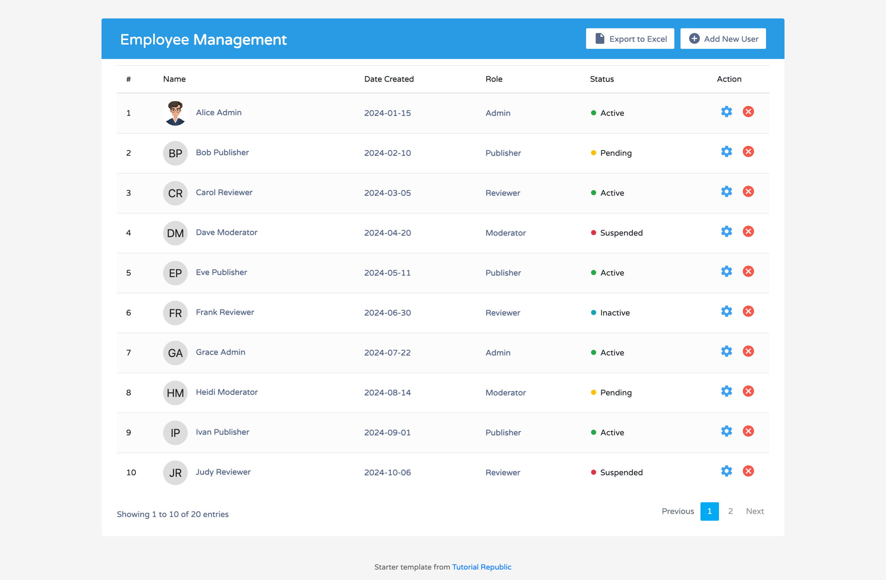
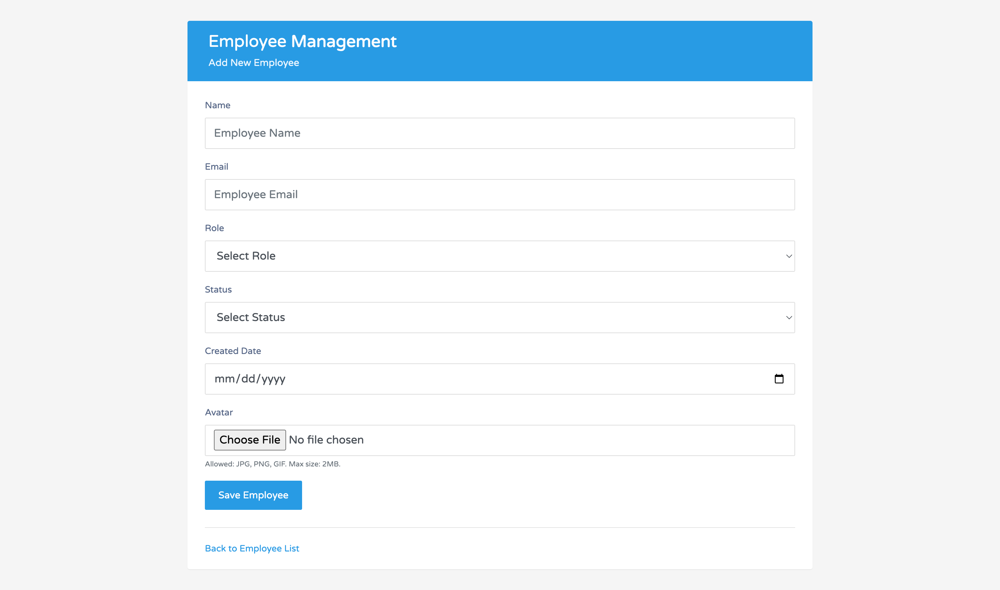

# EmployeeApp - Thymeleaf

Spring Boot MVC employee management app with Thymeleaf SSR & MySQL

## mySQL Workspace:

```sql
CREATE DATABASE emp
```

(Optional) Change mySQL connection password to match root password in `application.properties`:
```sql
ALTER USER 'root'@'localhost' IDENTIFIED BY 'Root@1234';
```

## Visuals



